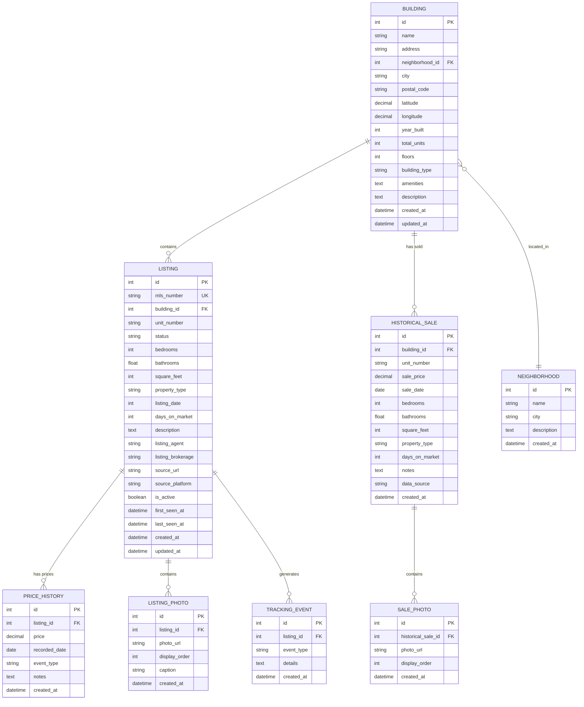

# Real Estate Search - Data Model

## Overview

This document describes the SQLite database schema for the Victoria Real Estate Tracker. The design supports:

1. **Listing tracking** - Monitor current listings with full property details
2. **Price history** - Track price changes over time for each listing
3. **Historical purchases** - Record sold data for buildings of interest
4. **Building analytics** - Compare metrics across buildings and neighborhoods

## Entity Relationship Diagram



## Table Specifications

### 1. NEIGHBORHOOD
Groups buildings by neighborhood for analytics.

| Column | Type | Description |
|--------|------|-------------|
| id | INTEGER PRIMARY KEY | Auto-increment ID |
| name | VARCHAR(100) NOT NULL | Neighborhood name (e.g., "Downtown", "James Bay") |
| city | VARCHAR(50) NOT NULL | City name (e.g., "Victoria") |
| description | TEXT | Optional neighborhood description |
| created_at | DATETIME DEFAULT CURRENT_TIMESTAMP | Record creation time |

**Indexes:**
- `idx_neighborhood_name` on `name`
- `idx_neighborhood_city` on `city`

---

### 2. BUILDING
Represents a condo building or multi-unit property.

| Column | Type | Description |
|--------|------|-------------|
| id | INTEGER PRIMARY KEY | Auto-increment ID |
| name | VARCHAR(200) NOT NULL | Building name (e.g., "The Janion") |
| address | VARCHAR(300) NOT NULL | Street address |
| neighborhood_id | INTEGER FK | Reference to NEIGHBORHOOD |
| city | VARCHAR(50) DEFAULT 'Victoria' | City |
| postal_code | VARCHAR(10) | Postal code |
| latitude | DECIMAL(10,8) | GPS latitude |
| longitude | DECIMAL(11,8) | GPS longitude |
| year_built | INTEGER | Construction year |
| total_units | INTEGER | Total units in building |
| floors | INTEGER | Number of floors |
| building_type | VARCHAR(50) | Type: "High-Rise", "Mid-Rise", "Low-Rise", "Townhouse" |
| amenities | TEXT | JSON array of amenities (e.g., `["gym", "parking", "storage"]`) |
| description | TEXT | Building description |
| created_at | DATETIME DEFAULT CURRENT_TIMESTAMP | Record creation time |
| updated_at | DATETIME DEFAULT CURRENT_TIMESTAMP | Last update time |

**Indexes:**
- `idx_building_name` on `name`
- `idx_building_neighborhood` on `neighborhood_id`
- `idx_building_location` on `latitude`, `longitude`

---

### 3. LISTING
Active or recently active property listings.

| Column | Type | Description |
|--------|------|-------------|
| id | INTEGER PRIMARY KEY | Auto-increment ID |
| mls_number | VARCHAR(20) UNIQUE | MLS listing number (e.g., "R3052391") |
| building_id | INTEGER FK | Reference to BUILDING (nullable for non-building properties) |
| unit_number | VARCHAR(20) | Unit/suite number (e.g., "1206") |
| status | VARCHAR(20) DEFAULT 'Active' | Status: "Active", "Pending", "Sold", "Expired", "Cancelled" |
| bedrooms | INTEGER | Number of bedrooms |
| bathrooms | REAL | Number of bathrooms (1.5, 2, etc.) |
| square_feet | INTEGER | Property square footage |
| property_type | VARCHAR(50) | Type: "Condo", "Townhouse", "Penthouse", "Studio" |
| listing_date | DATE | When the listing was posted |
| days_on_market | INTEGER | Calculated days since listing |
| description | TEXT | Listing description |
| listing_agent | VARCHAR(100) | Agent name |
| listing_brokerage | VARCHAR(100) | Brokerage name |
| source_url | VARCHAR(500) | URL to original listing |
| source_platform | VARCHAR(50) | Source: "Realtor.ca", "CondoDork", "Manual" |
| is_active | BOOLEAN DEFAULT 1 | Whether listing is currently active |
| first_seen_at | DATETIME | When we first discovered this listing |
| last_seen_at | DATETIME | When we last verified this listing |
| created_at | DATETIME DEFAULT CURRENT_TIMESTAMP | Record creation time |
| updated_at | DATETIME DEFAULT CURRENT_TIMESTAMP | Last update time |

**Indexes:**
- `idx_listing_mls` on `mls_number` (unique)
- `idx_listing_building` on `building_id`
- `idx_listing_status` on `status`, `is_active`
- `idx_listing_dates` on `listing_date`, `last_seen_at`

---

### 4. PRICE_HISTORY
Tracks all price changes for a listing.

| Column | Type | Description |
|--------|------|-------------|
| id | INTEGER PRIMARY KEY | Auto-increment ID |
| listing_id | INTEGER FK | Reference to LISTING |
| price | DECIMAL(12,2) NOT NULL | Price at this point in time |
| recorded_date | DATE NOT NULL | Date this price was recorded |
| event_type | VARCHAR(20) DEFAULT 'Price Change' | Type: "Initial", "Price Drop", "Price Increase", "Sold", "Delisted" |
| notes | TEXT | Optional notes about this price point |
| created_at | DATETIME DEFAULT CURRENT_TIMESTAMP | Record creation time |

**Indexes:**
- `idx_price_history_listing` on `listing_id`
- `idx_price_history_date` on `recorded_date`

**Notes:**
- Every price observation creates a new row
- Price drops can be calculated by comparing consecutive entries
- The most recent entry represents the current asking price

---

### 5. LISTING_PHOTO
Photos associated with current listings.

| Column | Type | Description |
|--------|------|-------------|
| id | INTEGER PRIMARY KEY | Auto-increment ID |
| listing_id | INTEGER FK | Reference to LISTING |
| photo_url | VARCHAR(500) NOT NULL | Local file path to photo (relative to storage root) |
| display_order | INTEGER DEFAULT 0 | Order for display |
| caption | VARCHAR(200) | Optional caption |
| created_at | DATETIME DEFAULT CURRENT_TIMESTAMP | Record creation time |

**Indexes:**
- `idx_photo_listing` on `listing_id`

---

### 6. HISTORICAL_SALE
Records of past sales for building history analysis.

| Column | Type | Description |
|--------|------|-------------|
| id | INTEGER PRIMARY KEY | Auto-increment ID |
| building_id | INTEGER FK | Reference to BUILDING |
| unit_number | VARCHAR(20) | Unit/suite number |
| sale_price | DECIMAL(12,2) NOT NULL | Final sale price |
| sale_date | DATE NOT NULL | Date of sale |
| bedrooms | INTEGER | Number of bedrooms |
| bathrooms | REAL | Number of bathrooms |
| square_feet | INTEGER | Square footage |
| property_type | VARCHAR(50) | Type: "Condo", "Townhouse", etc. |
| days_on_market | INTEGER | Days from listing to sale |
| notes | TEXT | Additional notes |
| data_source | VARCHAR(100) | Source: "Manual Entry", "Land Records", "Agent Report" |
| created_at | DATETIME DEFAULT CURRENT_TIMESTAMP | Record creation time |

**Indexes:**
- `idx_historical_sale_building` on `building_id`
- `idx_historical_sale_date` on `sale_date`
- `idx_historical_sale_unit` on `building_id`, `unit_number`

---

### 7. SALE_PHOTO
Photos for historical sales (if available).

| Column | Type | Description |
|--------|------|-------------|
| id | INTEGER PRIMARY KEY | Auto-increment ID |
| historical_sale_id | INTEGER FK | Reference to HISTORICAL_SALE |
| photo_url | VARCHAR(500) | Local file path to photo (relative to storage root) |
| display_order | INTEGER DEFAULT 0 | Display order |
| created_at | DATETIME DEFAULT CURRENT_TIMESTAMP | Record creation time |

---

### 8. TRACKING_EVENT
Audit log for tracking system events.

| Column | Type | Description |
|--------|------|-------------|
| id | INTEGER PRIMARY KEY | Auto-increment ID |
| listing_id | INTEGER FK | Reference to LISTING (nullable for system events) |
| event_type | VARCHAR(50) NOT NULL | Type: "Discovered", "PriceChange", "StatusChange", "Scraped", "Error" |
| details | TEXT | JSON or text with event details |
| created_at | DATETIME DEFAULT CURRENT_TIMESTAMP | Event timestamp |

**Indexes:**
- `idx_tracking_event_listing` on `listing_id`
- `idx_tracking_event_type` on `event_type`
- `idx_tracking_event_time` on `created_at`

---

## Key Design Decisions

### 1. Price History Tracking
- **Approach**: Append-only table with all price observations
- **Benefits**: 
  - Complete audit trail of price changes
  - Easy to calculate days-at-price and price-drop velocity
  - Supports price trend analysis

### 2. Building-Centric Model
- **Approach**: Separate BUILDING table that LISTING and HISTORICAL_SALE reference
- **Benefits**:
  - Enables building-level analytics (average $/sqft, turnover rate)
  - Historical sales linked to buildings for comparison
  - Neighborhood aggregation support

### 3. Historical Sales vs. Current Listings
- **Approach**: Separate tables for active listings vs. historical sales
- **Benefits**:
  - Different data availability (listings have agent info, sales have final price)
  - Historical sales can be manually entered without affecting active listing logic
  - Supports analysis of "what sold for what" in buildings of interest

### 4. Soft Deletes / Status Tracking
- **Approach**: `is_active` flag + `status` field instead of hard deletion
- **Benefits**:
  - Retain history of listings that went off-market
  - Track if listing sold, expired, or was cancelled
  - Re-appearances of same MLS# can be detected

---

## Sample Queries

### Get current listings for a building with latest prices
```sql
SELECT 
    l.mls_number,
    l.unit_number,
    l.bedrooms,
    l.bathrooms,
    l.square_feet,
    ph.price as current_price,
    ROUND(ph.price / NULLIF(l.square_feet, 0), 2) as price_per_sqft,
    l.listing_date,
    l.days_on_market
FROM listing l
LEFT JOIN (
    SELECT listing_id, price 
    FROM price_history ph1
    WHERE recorded_date = (
        SELECT MAX(recorded_date) 
        FROM price_history ph2 
        WHERE ph2.listing_id = ph1.listing_id
    )
) ph ON l.id = ph.listing_id
WHERE l.building_id = ?
  AND l.is_active = 1
ORDER BY ph.price DESC;
```

### Get price history for a specific listing
```sql
SELECT 
    recorded_date,
    price,
    event_type,
    LAG(price) OVER (ORDER BY recorded_date) as previous_price,
    price - LAG(price) OVER (ORDER BY recorded_date) as price_change,
    notes
FROM price_history
WHERE listing_id = ?
ORDER BY recorded_date DESC;
```

### Get historical sales for a building (price/sqft trend)
```sql
SELECT 
    unit_number,
    sale_price,
    square_feet,
    ROUND(sale_price / NULLIF(square_feet, 0), 2) as price_per_sqft,
    sale_date,
    days_on_market
FROM historical_sale
WHERE building_id = ?
ORDER BY sale_date DESC;
```

### Find price drops in the last 7 days
```sql
SELECT 
    l.mls_number,
    b.name as building_name,
    l.unit_number,
    ph_old.price as old_price,
    ph_new.price as new_price,
    ph_old.price - ph_new.price as price_drop,
    ROUND((ph_old.price - ph_new.price) / ph_old.price * 100, 2) as drop_percent,
    ph_new.recorded_date as drop_date
FROM price_history ph_new
JOIN price_history ph_old ON ph_new.listing_id = ph_old.listing_id
JOIN listing l ON l.id = ph_new.listing_id
JOIN building b ON b.id = l.building_id
WHERE ph_new.recorded_date >= date('now', '-7 days')
  AND ph_new.event_type = 'Price Drop'
  AND ph_old.recorded_date = (
      SELECT MAX(recorded_date) 
      FROM price_history 
      WHERE listing_id = ph_new.listing_id 
        AND recorded_date < ph_new.recorded_date
  )
ORDER BY drop_percent DESC;
```

---

## Photo Storage

Photos are stored locally in a directory structure:

```
photos/
├── listings/
│   ├── {mls_number}/
│   │   ├── 01.jpg
│   │   ├── 02.jpg
│   │   └── ...
│   └── ...
├── historical_sales/
│   └── {sale_id}/
│       └── ...
└── ...
```

### Photo Management Functions

**Purge Photos for Unwanted Listings**
```python
def purge_listing_photos(mls_number: str) -> int:
    """
    Remove all photos for a listing that is no longer of interest.
    Returns number of files deleted.
    """
    pass

def purge_orphaned_photos() -> int:
    """
    Remove photos for listings that no longer exist in database.
    Returns number of files deleted.
    """
    pass
```

## Historical Sales Import

Historical sales can be imported via CSV with the following columns:

| CSV Column | Required | Maps To |
|------------|----------|---------|
| `building_name` | Yes | Matched to BUILDING.name or creates new |
| `address` | Yes | BUILDING.address |
| `neighborhood` | No | Matched to NEIGHBORHOOD.name |
| `unit_number` | No | HISTORICAL_SALE.unit_number |
| `sale_price` | Yes | HISTORICAL_SALE.sale_price |
| `sale_date` | Yes | HISTORICAL_SALE.sale_date (YYYY-MM-DD) |
| `bedrooms` | No | HISTORICAL_SALE.bedrooms |
| `bathrooms` | No | HISTORICAL_SALE.bathrooms |
| `square_feet` | No | HISTORICAL_SALE.square_feet |
| `property_type` | No | HISTORICAL_SALE.property_type |
| `days_on_market` | No | HISTORICAL_SALE.days_on_market |
| `notes` | No | HISTORICAL_SALE.notes |

**Import Command:**
```bash
python -m real_estate_tracker import-historical-sales path/to/sales.csv
```

## Pre-populated Victoria Neighborhoods

The database is initialized with the following Victoria neighborhoods:

| Neighborhood | Description |
|--------------|-------------|
| Downtown | Central business district, high-rise condos |
| Harris Green | Dense residential, walkable to downtown |
| Chinatown | Historic area, mixed-use buildings |
| James Bay | Waterfront, Beacon Hill Park proximity |
| Fairfield | Residential, Cook Street Village |
| Fernwood | Arts district, character homes |
| Victoria West | Industrial turned residential, waterfront |
| Songhees | Upscale waterfront condos |
| Esquimalt | West of downtown, more affordable |
| Oak Bay | Ups residential, distinct municipality |
| Saanich East | Suburban, family-oriented |
| Saanich West | Suburban, near University of Victoria |
| View Royal | Westshore area, newer developments |
| Langford | Westshore, rapid growth area |
| Colwood | Westshore, Royal Roads University |

## Future Enhancements

1. **Market Statistics Table** - Pre-computed neighborhood/building averages
2. **Saved Searches Table** - User-defined search criteria for automated alerts
3. **Alert Configuration Table** - User preferences for price drop notifications
4. **Building Amenities Table** - Normalized amenity data with filtering support
5. **Unit Layouts Table** - Track floor plans and layout types per building
